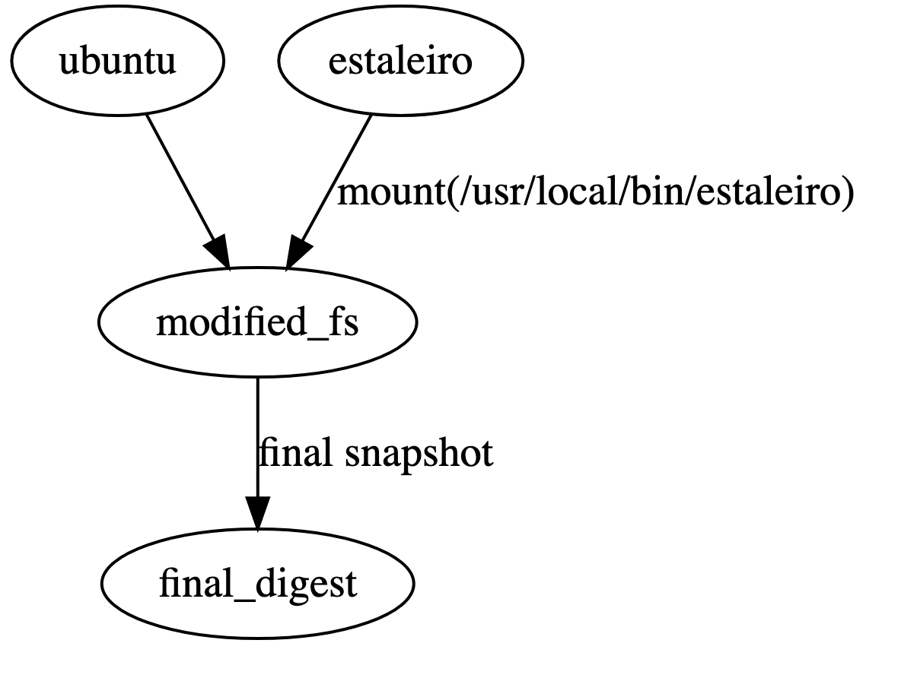
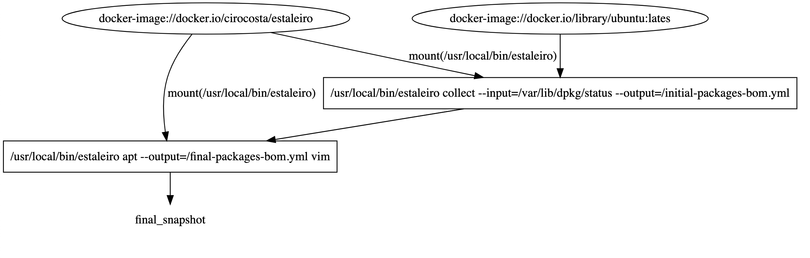

## DISCLAIMER

The content here has definitely a bunch of rough edges and is not polished at
all.

Nothing on it is set in stone, and it has even been barely reviewed by me - it's
a brain dump to foster discussions around the idea of building container images
leveraging some cool new tech that is out there in a way that might solve some
of our problems.

If you have any questions / comments / suggestions / feedback, feel free to
reach out to me on the Pivotal Slack channel (`@cscosta`), or even Twitter
(`@cirowrc`).


<!-- START doctoc generated TOC please keep comment here to allow auto update -->
<!-- DON'T EDIT THIS SECTION, INSTEAD RE-RUN doctoc TO UPDATE -->
**Table of Contents**

- [rethinking the way container images are built](#rethinking-the-way-container-images-are-built)
  - [the Concourse container image](#the-concourse-container-image)
  - [what's hard about dockerfiles](#whats-hard-about-dockerfiles)
    - [1. tracking what was added](#1-tracking-what-was-added)
    - [2. ensuring consistenty](#2-ensuring-consistenty)
  - [what if Dockerfiles didn't exist?](#what-if-dockerfiles-didnt-exist)
  - [the bare minimum of building container images](#the-bare-minimum-of-building-container-images)
  - [a primitive container image builder](#a-primitive-container-image-builder)
    - [compilers](#compilers)
    - [buildkit](#buildkit)
  - [a minimally viable frontend for our container images](#a-minimally-viable-frontend-for-our-container-images)
    - [gathering the base image](#gathering-the-base-image)
    - [installing packages](#installing-packages)
  - [talk about](#talk-about)
  - [references](#references)

<!-- END doctoc generated TOC please keep comment here to allow auto update -->


# rethinking the way container images are built

Hey,

We at the [Concourse for PCF](https://pivotal.io/concourse) team have been
maintaining for quite a while [a Helm chart for running Concourse on top of
Kubernetes](https://hub.helm.sh/charts/stable/concourse), and, wanting to ship
that to customers, showed that there's quite a good deal of uncertainty
involved.

```

  OSS USERS


          `helm/charts/stable/Concourse` ---> powers `hush-house`!

            :D


  CUSTOMERS


          I'd like that too!


  US

          we're still figuring it out

          ¯\_(ツ)_/¯


```


Although we're fairly used to the traditional ways of getting the Concourse code
in a state where it can be distributed as a [BOSH release](https://bosh.io/docs/release/) 
artifact on [PivNet](https://network.pivotal.io/), we're very new to doing so
for customers who would like to have it on their [PKS](https://pivotal.io/platform/pivotal-container-service)
installations - differently from a BOSH release, now there are 
[container images](https://github.com/opencontainers/image-spec) and some
wrapping around the formation of those Kubernetes objects.

If we consider that there are several steps to go from "we have a container
image" and want to get that to customer hands, there's clearly some steps to go
through. 

Thinking of that problematic as code in the form of a
[Makefile](https://www.gnu.org/software/make/), where you define a set of
targets that you want to get to, and the dependencies that need to be
satisfied to achieve it, we could present the problem as such:


```Makefile
customer_artifact: download_from_pivnet


download_from_pivnet: artifact_with_osl_file


artifact_with_osl_file: container_image_that_is_scannable


container_image_that_is_scannable:
    echo "¯\_(ツ)_/¯"
```

That is,


1. **to get that to customers**, *it needs to be on PivNet,*
> so that we can attest what has been distributed to who

2. **to have it on PivNet**, *it needs an [OSL](https://docs.google.com/document/d/1DsXUumrjRXkY4ILxEwxJaBV-rMIYlb4Esc-JDZOYLBA/) file*
> so that we can disitribute the copyright and prove that we don't have any
> licenses that would hurt our customers

3. **to get the OSL file**, *it needs to let norsk know where to scan source code*
> so that it can know what are those licenses, and gather copyright info

4. **to let Norsk know where to scan**, *it needs to `¯\_(ツ)_/¯`*


```


    customer artifact     (waits on)
      
        release on pivnet     (waits on)

            artifact with osl file  (waits on)

            .----------------------------------------.
            |                                        |
            |   container image that is scannable    |
            |                                        |
            *------------ bottleneck? ---------------*
                            |
                            *---> impacts all the rest :(
                                            |
                                            |
                                            .
                                     all the cool features that
                                     the team develops don't get
                                     to the hands of customers
                                      

```


Thus, with a single goal in mind - shipping Concourse container images to
customers -, we can see that if at the very bottom of it - creating a container
image that is scannable -, there's friction, the whole process can get delayed,
impacting all of the rest of the process of getting the great features that the
team developed to the hands of our customers.


```


                        .----------------------------------------.
      .---------.       |                                        |
      |  source | ====> |   container image that is scannable    |
      *---------*   .   |                                        |
                    .   *----------------------------------------*
                    .
                    .
                    ..... could this be better?

```


To make things more concrete, let's look at one of the container images that we
need to scan to ship Concourse.


## the Concourse container image

Although Concourse has more then 10 container [images that we publish on
DockerHub](https://hub.docker.com/u/concourse) (as of today) that are consumed
by OSS folks, we can look at the case of [`concourse/concourse`](https://github.com/concourse/concourse-docker) - 
the image that provides the Concourse binaries with all bateries included:


```dockerfile
# defining the base image that will produce the final concourse/concourse
# image - this adheres to pivotal practice of using `ubuntu:bionic` images.
#
FROM ubuntu:bionic AS ubuntu


# creating a step that just unpacks a tarball that has Concourse's "batteries"
#
FROM ubuntu AS assets

        # retrieve the concourse tarball that contains all of the concourse
        # binaries and other necessary artifacts.
        #
        COPY ./linux-rc/*.tgz /tmp
        RUN tar xzf /tmp/*tgz -C /usr/local


# the final step that will define the layers that get in the final image to be
# shipped to people
#
FROM ubuntu


        # packages needed at runtime
        #
        RUN apt update && apt install -y \
            btrfs-tools \
            ca-certificates \
            dumb-init \
            iproute2 \
            file


        # retrieve the bits that were extracted in the previous step.
        #
        COPY --from=assets /usr/local/concourse /usr/local/concourse


        # some environment variables (there are more) and other runtime
        # configurations
        #
        ENV CONCOURSE_SESSION_SIGNING_KEY     /concourse-keys/session_signing_key
        STOPSIGNAL SIGUSR2
        ENTRYPOINT ["dumb-init", "/usr/local/concourse/bin/concourse"]
```

While this has worked great for us for a long time, when it comes to now making
sure that not only this, but all of our other 10+ images are all scannable, some
challanges start arising.


## what's hard about dockerfiles

### 1. tracking what was added

Having the ability to put anything you'd want into the final container image is
just so easy - most of the time that's just a command away, and it can
potentially leave no traces (for good or bad):


```dockerfile
# retrieve a file from who knows where
#
RUN curl -SOL https://something.sketchy.hax


# add a file that has who knows what
#
ADD ./anything /anywhere


# run a script that does whatever
#
RUN a-script-that-downloads-shady-stuff.sh
```

Which, when it comes to shipping to customers, leads to questions like:

- what was the SHA of that tarball that brought contents?
- how can I tie that tarball to source code?
- what are the versions of those packages?
- can I get the source of those packages?
- what debian repository brought those packages?
- do I trust the repositories that brought packages to this image?


```


     concourse/concourse
    .-------------------.
    | 
    |   btrfs-progs                           version=?
    |   btrfs-tools                           sha=?
    |   ca-certificates                       repository?
    |   /usr/local/concourse/bin/concourse    tarball_sha=?
    |   /usr/local/concourse/bin/gdn          source=?
    |   ...


```

### 2. ensuring consistenty

While it's known that some best practices exist around creating container
images, [Dockerfile](https://docs.docker.com/engine/reference/builder/)s lack 
ways of enforcing those (or at least letting the user known that they are
missing something out).

Some examples:

- ensuring all container images are built from a particular base image
- guaranteeing that packages added have their `deb-src` counterpart providing
  the source code
- enforcing the use of non-root users
- avoiding leaving garbage from compile-time dependencies


```
    

    .-----------------------.
    |                       |
    |  concourse/concourse  |
    |                       | --> does it come from `ubuntu:bionic`?
    *-----------------------*     what's the version of each package?
                                  does it run as non-user?


```

While the traditional way of going over these enforcements have been post-facto,
there's the potential to standardize across the definition of what "good means"
in ways that developers wouldn't shoot themselves in their foots.


## what if Dockerfiles didn't exist?


In order to go after some of those problems, we could start reminding ourselves
of the basic principles that allows a `docker build` to work with Dockerfiles.


A nice way of doing so is pretending that Dockerfiles don't even exist, and
trying to achieve what they can achieve without it.


```


                        .-------------------.
      .---------.       |                   |
      |  source | ====> |   container image |
      *---------*   .   |                   |
                    .   *-------------------*
                    .
                    .
                    ..... without a Dockerfile!


```


## the bare minimum of building container images


If we erase from our minds the fact that `Dockerfile` is the de-facto way of
building container images today, we could perhaps summarize the creation of
an image as:


1. bringing some content from a local directory
2. installing some dependencies
3. configuring some runtime parameters (environment variables, volumes, etc)


```

      files -----------------------.
                                   |
           +                       |
                                   |
      debian packages -------------+---(magic building)---==> container image
                                   |
           +                       |
                                   |
      container runtime configs ---*


```


i.e., regardless of how we get to that final container image, all we have to do
is get some stuff in, install some packages and configure how a runtime would
be configured to properly run our software.


Let's see how we could try achieving that with pure `bash` and `docker`
commands (just like Docker did in its very infancy).


## a primitive container image builder

Having the ability to run a container from a given image (using the `docker`
engine), we could think of each step in the container creation pipeline as a
mutation to a previous image, and subsequent creation of other images.

```

  IMAGE

      ==> mutate

          IMAGE + mutations

```

Let's dig in:


```bash
# a *very* primitive "Dockerfile"-equivalent that
# is able to build a container image.
#
#
main () {
	local image

	image=$(docker pull ubuntu:bionic -q)
	image=$(add $image $(realpath ./file.txt) /file.txt)
	image=$(run $image 'apt-get update && apt-get install -y vim')
	image=$(entrypoint $image "/bin/echo")
	image=$(cmd $image "hello!!!")

	docker tag $image cirocosta/image
}
```

(see https://github.com/cirocosta/sample-manual-dockerfile)


```

FROM ubuntu:bionic


    1. pull initial root filesystem (ubuntu:bionic)


    FS_1: ubuntu

                    .--------------------
                    |
                    |    .
                    |    ├── etc
                    |    │   └── test.conf
                    |    └── var
                    |


ADD ./file.txt /file.txt


    1. create a container from a snapshot `FS_1`
      1.1 mount `file.txt` inside the container
    2. copy the file to the desired location


    FS_2 = snapshot(FS_1)


              
                    .--------------------
                    |
                    |    .
                    |    ├── etc
                    |    │   └── test.conf
                    |    ├── var
     file.txt-------+----└── mnt
                    |        └── file.txt (readonly mount)
                    |
                    |
                    |   --> /bin/sh -c cp /mnt/test.conf /file.txt
                    |
                    |


                    .--------------------
                    |
                    |    .
                    |    ├── etc
                    |    │   └── test.conf
                    |    ├── file.txt  <<<< new file! 
                    |    └── var
                    |


              >> we just mutated the filesystem.


RUN apt update && apt install -y vim


    FS_3 = snapshot(FS_2)


                    .--------------------
                    |
                    |    .
                    |    ├── etc
                    |    │   └── test.conf
                    |    ├── file.txt
                    |    └── var
                    |
                    |
                    |   --> /bin/sh -c apt update && apt install -y vim
                    |


      
                ==> mutates the filesystem, adding the contents of the
                    vim package and some other `apt` stuff


                    .--------------------
                    |
                    |    .
                    |    ├── etc
                    |    │   └── test.conf
                    |    ├── file.txt
                    |    ├── usr                  //
                    |    │   └── bin              //  
                    |    │        └── vim         //   new!!!1
                    |    └── var
                    |        └── lib              //
                    |             └── apt         //
                    |                  └── lists  //  neww!!1
                    |


                ==> take a snapshot of this final stage and distribute it


```


The point is  - all that it takes is to have a way of:

<br />

1. creating a container from a given image
2. mutating that filesystem
3. taking a snapshot of that filesystem at a given point in time

<br />

Nest that multiple times, and one can have any Dockerfile built. 


```


  IMAGE

      ==> mutate

          ==> IMAGE+mutations
            
              ==> mutate

                  ==> IMAGE+mutations+mutations

                      ...


```


But, as one can imagine, that's not a great experience, just like it wouldn't be
a great experience to code in assembly when trying to write a web application -
with a higher-level language, one can benefit from focusing on what really
matters: the business logic.


```


        that's just too low level!

            (and annoying to write)


```

To do so do, what you end up with is needing something that resembles a
compiler.


### compilers 

If we compare Dockerfiles to regular compiled programming languages, and for a
moment, assume that the process of going from a Dockerfile to a container image
is a compilation process, we could start drawing some quite neat analogies.

As I have written quite a bunch of C back then when I was at the University,
let's take a look at an example hypothetical C compiler.


```

                   .------------.
                   |            |
      source ----> |  compiler  | ------>  output
                   |            |
                   *------------*

       c            C compiler           binary


```


As there's a clear distinction between the types of jobs that the compiler does
in different phases, and that innovation can happen differently in each front,
some compiler infrastructures like [LLVM](https://llvm.org/) separate that quite
clearly in two fronts, with a common "lower level language" in the middle (the
intermediary representation - IR):

- the `frontend`, dealing with syntax and semantics
- the `backend`, dealing with the process of optimizing the code and creating
  the final output.


```

    source ---> frontend  ----> IR  ---> backend  ---> output


   C code       clang       LLVM IR      LLVM          binary

```


That way,  C language designers can develop code that makes the C language
specification move forwards, not having to deal with the dragons of optimizing
the compilation steps, alongside Fortran developers, who target the same
intermediary representation, that can benefit from the same backend.


```

    source ---> frontend  ----> IR  ---> backend  ---> output


   C code       clang       LLVM IR      LLVM          binary
   FORTRAN      flang
   Swift        ...
   Rust         ...
   ...          ...


```

And, that's what's hapenning *right now* for container images.


### buildkit

In 2017, some folks at [Docker](https://www.docker.com/) started working on ways
of decoupling the docker engine's build mechanism so that it could be iterated
on in a faster way.


```


                              .-------> dockerd
    docker engine --> moby  --+-------> docker cli
                              *-------> buildkit
                              ... other components


```


[Buildkit](https://github.com/moby/buildkit) comes with the same mindset as LLVM - 
provide a common infrastructure for building container images, separating the
concerns of developing frontends from the backend infrastructure.


That means that now we're at a turning point where we can focus on the
innovation where it matters, and don't need to reivent the wheel when it comes
to creating those container images


```


    source -------> frontend  ----> IR  ---> backend  ---> output


    Dockerfile    dockerfile.v0     LLB      buildkitd    containerimage

     

    |                           |    |                    |
    *---------------------------*    *--------------------*

     understanding what to build      figuring out how to build
                                       +  actually doing so

```

That backend infrastructure leverages those exact same three concepts that we talked
about before when we were creating the primitive image builder:


1. creating a container from a given image


```
  

  run (image + config) 


        ===> materialized as ==>


               container ----------------
               |  
               |  leveraging that filesystem
               |             +
               |     using that config


```


2. mutating that filesystem


```


  
    container ----                                     container ---------
    |                                                  |
    |   filesystem       ==> "run some commands ..."   |  modified filesystem
    |                                                  |
    

```


3. taking a snapshot of that filesystem at a given point in time


```


      container ---------
      |
      |  modified filesystem        ===> snapshot() ===>    image
      |
    


```


Aside from that, just like a compiler backend, it takes care of all of the
optimizations that would be hard for us to implement in our very primitive
builder - caching and running steps in parallel.


```


                        SYNTAX                 --------.
                           ===>                        |
                                                       |
                             FRONTEND                  |  what we care about
                                  ===>                 |
                                                       |
             .------                LLB        --------*
             |                        ===> 
 buildkitd   |
             |                          STATE MUTATIONS 
             *------                                 ===> final container image


```


## a minimally viable frontend for our container images - `estaleiro`

With that idea of what most of our container images are, I went on defining a
syntax that could represent those concepts, in a way that could satisfy some of
the requirements that are placed on products trying to ship bits to customers,
while, at the same time, leaving space for developers to have a good developer
experience.


```


      local files -----------------.
                                   |
           +                       |
                                   |
      debian packages -------------+---(magic building)---==> container image
                                   |
           +                       |
                                   |
      container runtime configs ---*


```

To build that syntax up right from actual needs, we can break those down into
certain "content installation steps":

- setting up a base image
- installing debian packages
- getting local files in
- setting container runtime configurations


### the base image

As Concourse always leverages a base image that is not just plain
[scratch](https://hub.docker.com/_/scratch), it made sense for me to start with
the retrieval of an image that the user specifies to move forward with the
mutations later on.


```hcl
# declaration of how we want the final image to
# look like once it gets built.
#
image "cirocosta/sample" {

  # the base image that powers the final container
  # image that we're building.
  #
  base_image {
    name = "ubuntu"
    ref  = "bionic"
  }

}
```

Putting that through what would be the equivalent of a compilation pipeline,
we'd translate such syntax into LLB in our frontend:


```


      estaleiro.hcl  ===>  estaleiro frontend ==> LLB  ==> buildkitd ==> image


```


To get a sense of how the LLB looks like, let's dig in:


```yaml
op:
  source.image: "docker-image://docker.io/library/ubuntu:latest@sha256:c303f19cfe9ee92badbbbd7567bc1ca47789f79303ddcef56f77687d4744cd7a"
  digest: "sha256:9d0df2288a6f52c368c12a5fc188130f6db0125cd446bbf882cb2d513760bc73"

op:
  source.image: "docker-image://docker.io/cirocosta/estaleiro@sha256:f27dd2a0011116a05346f966c79699a0bb10ff197240af3d90efd11543dfa43a"
  digest: "sha256:d9e85dc882e618445ae8164dd5dee13d7ba8bc9b18487cca4338e5fa51aa3913"

op:
  inputs:
    - sha256:9d0df2288a6f52c368c12a5fc188130f6db0125cd446bbf882cb2d513760bc73
    - sha256:d9e85dc882e618445ae8164dd5dee13d7ba8bc9b18487cca4338e5fa51aa3913
  exec:
    args: ["/usr/local/bin/estaleiro", "collect", "-i=/var/lib/dpkg/status"]
  mounts:
    - input: 0
      dest: "/"
    - input: 1
      dest: "/usr/local/bin/estaleiro"
  digest: "sha256:155669101ce3ce82852d075af1a68fb32730100c720993b764fbfac886dffe12"

op:
  inputs: 
    - sha256:155669101ce3ce82852d075af1a68fb32730100c720993b764fbfac886dffe12
  digest: "sha256:031e04205cbb52e5ad87530ca0fc659586048bf8bc7b028d47397fd4a3cf6fc8"
```

We could rewrite that to some more simpler terms:

```yaml
op:
  source.image: "docker-image://docker.io/library/ubuntu:latest"
  digest: "ubuntu"

op:
  source.image: "docker-image://docker.io/cirocosta/estaleiro"
  digest: "estaleiro"

op:
  inputs:
    - ubuntu
    - estaleiro
  exec:
    args: ["/usr/local/bin/estaleiro", "collect", "-i=/var/lib/dpkg/status"]
  mounts:
    - input: 0
      dest: "/"
    - input: 1
      dest: "/usr/local/bin/estaleiro"
  digest: "modified-fs"

op:
  inputs: 
    - modified-fs
  digest: "final-digest"
```

As that all boils down to a directed acyclic graph (DAG), we can represent that
as such:




And, here's where `estaleiro` comes as a nice addition to the flow of creating
container images - because it curates how the final snapshot gets produced, it
can already give us two things:


1. the digest of the base image that was used at build time
2. the list of packages that were originally included in it.


```


    1. fetch base image

        ==> digest


    2. gather packages included in the base image

        ==> initial bill of materials


    3. snapshot
      
        |
        |
        *---------->   snapshot (filesystem) + configuration ==> container
                                                                 image to be pushed
                                                                 to a registry


```

And, again, as we have control of all of those steps, and a container image is
composed of both the filesystem and an image configuration (which we control),
we can embed that bill of materials right into the final image configuration in
the form of labels:


```


      syntax

              ==> 
                  
                   mutations
                      (+ bill of materials as a an artifact)


                        ==>

                              final image
                                (+ labels with the bill of materials)


```

For instance, by running just this step, we'd end up with the following bill of
materials:


```yaml
base_image:
  name: docker.io/library/ubuntu
  digest: sha256:c303f19cfe9ee92badbbbd7567bc1ca47789f79303ddcef56f77687d4744cd7a
  packages:
    - name: fdisk
      version: 2.31.1-0.4ubuntu3.3
      source_package: util-linux
      architecture: amd64
    - name: libpam-runtime
      version: 1.1.8-3.6ubuntu2.18.04.1
      source_package: pam
      architecture: all
    - name: libncurses5
      version: 6.1-1ubuntu1.18.04
      source_package: ncurses
      architecture: amd64
    # ...
```


Building on those premises, let's move on with package installation.


### installing packages


Continuing with the approach of going from syntax to the final execution graph,
things are not much different for packages - in a given part of that step, we
run the equivalent of an `apt install`, mutating the filesystem in a way that
end up with the packages installed.

Here's how the syntax looks like:


```hcl
# declaration of how we want the final image to
# look like once it gets built.
#
image "cirocosta/sample" {


  # the base image that powers the final container
  # image that we're building.
  #
  base_image {
    name = "ubuntu"
    ref  = "bionic"
  }


  # a package that we want to have included in our
  # final container image.
  #
  apt {
    package "vim" {}
  }


}
```

Which, translating to LLB, turns into:



As you can see, there's a little encantation there - `estaleiro apt [...]` -,
and that's  on purpose: 

- using just plain `apt-get` like in a regular Dockerfile, we wouldn't be able
  to get all of the information that we'd like to form a comprehensive bill of
  materials.

Even more: there are certain defaults there that might not be desireable.

For instance, consider the following sample Dockerfile:

```Dockerfile
FROM ubuntu


# update the local apt database that powers `apt` to know from which
# repositories it can fetch specific packages from.
#
RUN apt update


# retrieve the `vim` package (as well as suggestions and recommendations)
# following what's present in the current database
#
RUN apt install -y vim
```

That is, during the first step, `apt` looks at the file `/etc/apt/sources.list`
(and others under `/etc/apt/sources.list.d`).


Looking at the default file that ships with the Ubuntu base image, we can see
what are all of those repositories that `apt` would retriieve lists of packages
from.


```


deb http://archive.ubuntu.com/ubuntu/  bionic           main restricted
deb http://archive.ubuntu.com/ubuntu/  bionic-updates   main restricted

deb http://archive.ubuntu.com/ubuntu/  bionic           universe
deb http://archive.ubuntu.com/ubuntu/  bionic-updates   universe

deb http://archive.ubuntu.com/ubuntu/  bionic           multiverse
deb http://archive.ubuntu.com/ubuntu/  bionic-updates   multiverse

deb http://archive.ubuntu.com/ubuntu/  bionic-backports main restricted universe multiverse

deb http://security.ubuntu.com/ubuntu/ bionic-security  main restricted
deb http://security.ubuntu.com/ubuntu/ bionic-security  universe
deb http://security.ubuntu.com/ubuntu/ bionic-security  multiverse


```

Interestingly though, this set of repositories is, by default, broader than what
it should from the interpretation of what `main`, `restricted`, `universe`, and
`multiverse` means:


|                 | FREE     | NON-FREE
|-----------------|----------|-----------
| **SUPPORTED**   | main     | restricted
| **UNSUPPORTED** | universe | multiverse


And, if we don't take into account where those packages that we install come
from, we essentially can't say whether we're consuming software that is
supported or not by Canonical.

Consider, for instance, the output of `dpkg -l`, a simple listing of all of the
packages installed in the system:

```

||/ Name            Version            Architecture  Description
=======================================================================
ii  adduser         3.116ubuntu1       all           add and remove ...
ii  apt             1.6.11             amd64         commandline pac...
ii  base-files      10.1ubuntu2.5      amd64         Debian base sys...
ii  base-passwd     3.5.44             amd64         Debian base sys...
ii  bash            4.4.18-2ubuntu1.2  amd64         GNU Bourne Agai...
ii  bsdutils        1:2.31.1-0.4ubuntu amd64         basic utilities...

```

We simply can't tell where things are coming from.

Another problem with using that default list of repositories is that we can't
tell if a particular version of a package that we fetched at a given time even
has sources that a team like OSLO would be able to scan.

```


      apt install vim

        ===> fetched `vim.deb` from a debian repository

            ==> brings a bunch of dependencies together

                |
                *---> did all of them have source packages too?


```

That's all because to be able to let `apt` retrieve a package, we'd need to tell
it that there are debian source repositories that it could reach.

For instance:

```
deb     http://archive.ubuntu.com/ubuntu/  bionic  main restricted
deb-src http://archive.ubuntu.com/ubuntu/  bionic  main restricted
```


To solve those problems, the approach that we take here is to do the debian
package fetching ourselves, after `apt` had already figured out for us what are
the packages that we'd need to download.


```

    ESTALEIRO
        |
        |
        *---> "Hey `apt`, I'd like to install `vim`

                which debian packages should I download?
                  oh, and by the way, from where?

                  kthx!

                                                                   APT
                                                                    |
                            ooh hey, go fetch these:            <---*
                              - stdlib at `http://blabla` w/ md5sum=foo      
                              - vim at `http://blelble`   w/ md5sum=bar

        
        ESTALEIRO
          |
          |
          *--> "awesome! thx!"
            |
            *---->  (writes down where all those debs will come from)
              

              " packages:
                  - name: vim
                    version: 1.2.3
                    uri: https://archive.ubuntu.bla/blabla
                    md5sum: dadssdsd
              "


```

As, at this point, we know not only where those debian packages would come from,
but also what are all of the other side dependencies that the package would
bring, we take advantage of that and start the process of figuring out whether
the source packages for not only `vim,` but its dependencies too, can be found:


```

  ESTALEIRO
    |
    |
    *---> "hey apt, btw, would you mind also
           checking out where could I get the source
           of some packages?

              - vim=1.2.3
              - stdlib=3.1.2

           thx!

                                                            APT
                                                             |
                                                  ¬_¬   <----*
                                              sure ...


                                                            APT
                                                             |
                   vim: http://archive...blabla/source  <----*
                   stdlib: http://sources.blabla        <----*


    ESTALEIRO
        |
        |
        *--> thx again!

              (writes down that extra info)


```


In case everything went well, we then concurrently fetch them all, storing them
at a particular directory, and then set that up as a perfectly valid debian
repository that just turns out to be served from a local directory (just like
you can do that with a `cdrom` if you're bringing packages to an offline machine
back in the day):


```
  
      ESTALEIRO
        |
        *----> concurrently fetches all debs
                  |
                  *---> creates a package listing (deb repo index)
                          |
                          |
                          *---> modifies `/etc/apt/sources.list` to point to it

```

With all of the debs installed, and having a local debian repository, we can use
a plain `apt install` to install those debian packages - as we just have the
local debian repository set, there's external connections being made, just plain
file retrieval from the filesystem.


```


    ESTALEIRO
      |
      *-------> hey apt, would you mind installing `vim`?


                                                            APT
                                                             |
                                           sure!        <----*

                                  (figures out the interdependency
                                   between them and installs them
                                   directly from the filesystem)


```

At this point them, we have three things:

- a base image that was mutated with packages added
- a bill of materials of the base image (image reference and packages installed
  by default)
- a "changeset bill of materials" that contains a listing of all of the packages
  that were further installed by us


```


                                  .-------------------.
      .---------.                 |                   |
      |  source | =============>  |   container image | + runtime config
      *---------*   &             |                   |      label
                    .             *-------------------*        ^
                    .                                          |
                    .                                       .--*
                    .                                       |
                    ..... initial bill of materials --------+
                    ..... changeset ------------------------*

```

As a final result, we can see how our bill of material expanded to include the
changeset:


```yaml
base_image:
  name: docker.io/library/ubuntu
  digest: sha256:c303f19cfe9ee92badbbbd7567bc1ca47789f79303ddcef56f77687d4744cd7a
  packages:
    - name: fdisk
      version: 2.31.1-0.4ubuntu3.3
      source_package: util-linux
      architecture: amd64
    - name: libpam-runtime
      version: 1.1.8-3.6ubuntu2.18.04.1
      source_package: pam
      architecture: all
    - name: libncurses5
      version: 6.1-1ubuntu1.18.04
      source_package: ncurses
      architecture: amd64
    # ...
changeset:
  packages:
    - name: vim-runtime
      version: 2:8.0.1453-1ubuntu1.1
      source_package: vim
      location:
          uri: http://archive.ubuntu.com/ubuntu/pool/main/v/vim/vim-runtime_8.0.1453-1ubuntu1.1_all.deb
          name: vim-runtime_2%3a8.0.1453-1ubuntu1.1_all.deb
          size: "5435124"
          digest: MD5Sum:0ec3148ec2668dfbb8d357dc8f6240e6
      source:
        - uri: http://archive.ubuntu.com/ubuntu/pool/main/v/vim/vim_8.0.1453-1ubuntu1.1.dsc
          name: vim_8.0.1453-1ubuntu1.1.dsc
          size: "2934"
          digest: SHA256:c85b2abcddbd7abc07fb06bc3a1b3fb6b80c2316e787abe05bb4d6909dc831f2
        - uri: http://archive.ubuntu.com/ubuntu/pool/main/v/vim/vim_8.0.1453.orig.tar.gz
          name: vim_8.0.1453.orig.tar.gz
          size: "13434095"
          digest: SHA256:ddf3f1baf0aa8f2a988bd6ef3ee305a6cd99f365de9024faa2827a1344be8679
        - uri: http://archive.ubuntu.com/ubuntu/pool/main/v/vim/vim_8.0.1453-1ubuntu1.1.debian.tar.xz
          name: vim_8.0.1453-1ubuntu1.1.debian.tar.xz
          size: "190292"
          digest: SHA256:97553c5f79470dba084e5de2e33805c1222e5233c1d5fb31866fd5bf90d611ec
    - name: vim
      version: 2:8.0.1453-1ubuntu1.1
      source_package: ""
      location:
          uri: http://archive.ubuntu.com/ubuntu/pool/main/v/vim/vim_8.0.1453-1ubuntu1.1_amd64.deb
          name: vim_2%3a8.0.1453-1ubuntu1.1_amd64.deb
          size: "1151556"
          digest: MD5Sum:a1fc106a6538bb091ef9787c07c69de0
      source:
        - uri: http://archive.ubuntu.com/ubuntu/pool/main/v/vim/vim_8.0.1453-1ubuntu1.1.dsc
          name: vim_8.0.1453-1ubuntu1.1.dsc
          size: "2934"
          digest: SHA256:c85b2abcddbd7abc07fb06bc3a1b3fb6b80c2316e787abe05bb4d6909dc831f2
        - uri: http://archive.ubuntu.com/ubuntu/pool/main/v/vim/vim_8.0.1453.orig.tar.gz
          name: vim_8.0.1453.orig.tar.gz
          size: "13434095"
          digest: SHA256:ddf3f1baf0aa8f2a988bd6ef3ee305a6cd99f365de9024faa2827a1344be8679
        - uri: http://archive.ubuntu.com/ubuntu/pool/main/v/vim/vim_8.0.1453-1ubuntu1.1.debian.tar.xz
          name: vim_8.0.1453-1ubuntu1.1.debian.tar.xz
          size: "190292"
          digest: SHA256:97553c5f79470dba084e5de2e33805c1222e5233c1d5fb31866fd5bf90d611ec
      # ...
```


## talk about

- you can try it out right now with a recent-enough version of Docker
- developer productivity when checking if you got all right
- summary


## references

- [alternatives to distroless requirements and recommendations](https://docs.google.com/document/d/14jYh0YpCJ2NNYXzSye46JsL8eSFRgysP6TVeSZu7SD4/edit) 
